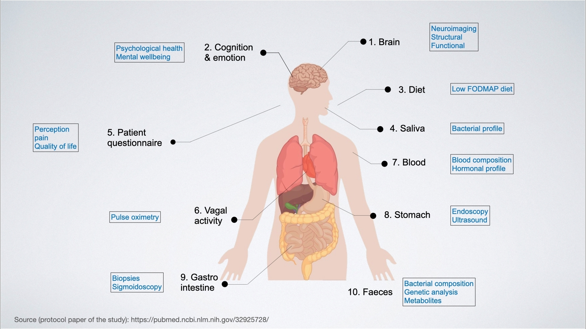

`README.md`, `ore-psych-ml-ibs-base0.ipynb`, `ore-psych-ml-ibs-base0.ipynb`, `ore-psych-ml-ibs-loocv.ipynb` (ver. 2022-12-16) accompanying the paper


# A psychological symptom based machine learning model for clinical evaluation of irritable bowel syndrome

by Noman Haleem, ...., Arvid Lundervold - submitted to [Open Research Europe](https://open-research-europe.ec.europa.eu)

See Overleaf: https://www.overleaf.com/project/634f08bdc38b18d90d1fb316  (restricted)

_This study is funded through Horizon 2020 research and innovation program (grant agreement No. 895219), Norwegian
Research Council (grant ID FRIMED-BIO276010), Helse Vest’s Research Funding (grant ID HV912243), and Trond Mohn
Research Foundation (grant ID BFS2018TMT07)._


### Abstract


**Background**: Irritable bowel syndrome (IBS) is a chronic functional gastrointestinal disorder characterized by recurrent abdominal pain associated with alterations in stool form and/or stool frequency. Commodities such as anxiety, depression, fatigue, and insomnia are frequently reported by patients suffering from IBS. Identification of these symptoms should thus be an integral part of an IBS assessment. However, an optimal tool to screen for core psychological symptoms in IBS is still missing. Here, we aim to develop a psychological symptom based machine learning model to efficiently help clinicians to identify patients suffering from IBS.
**Methods**: We developed a machine learning workflow to select the most significant psychological features associated with IBS in a dataset including $49$ patients with IBS and $35$ healthy controls. These features were used to train three different types of machine learning models: logistic regression, decision trees and support vector machine classifiers; which were validated on a holdout validation dataset and an unseen test set. The performance of these models was compared in terms of balanced accuracy scores.
**Results**: A logistic regression model including a combination of symptom features associated with anxiety and fatigue resulted in a balanced accuracy score of $0.93$ ( $0.81$ - $1.0$ ) on unseen test data and outperformed the other comparable models. The same model correctly identified all patients with IBS in a test set (recall score $1$) and misclassified one non-IBS subject (precision score $.91$). 
A complementary post-hoc leave-one-out cross validation analysis including the same symptom features showed similar, but slightly inferior results (balanced accuracy $0.84$, recall $0.88$, precision $0.86$).
**Conclusions**: Inclusion of machine learning based psychological evaluation can complement and improve existing clinical procedure for diagnosis of IBS.


***

#### The  [`ore-psych-ml-ibs-base0.ipynb`](./ore-psych-ml-ibs-base0.ipynb) Jupyter notebook relates to the demographiscs, descriptive statistics and basic ML procedures in the paper

#### The  [`ore-psych-ml-ibs-base1.ipynb`](./ore-psych-ml-ibs-base1.ipynb) notebook relates to the core ML procedures (LR, DT, SVC), tables, and figures in the paper

#### The  [`ore-psych-ml-ibs-loocv.ipynb`](./ore-psych-ml-ibs-loocv.ipynb) notebook relates to the LOOCV analysis in the paper


#### We assume [Anaconda](https://www.anaconda.com) is installed, then set up a `oreibs0` conda environment:

```python
### create the conda environment oreibs0:
conda create --name oreibs0 -c conda-forge scikit-learn python=3.8

## activate conda environment:
conda activate oreibs0

## install packages using conda
conda install ipython
conda install jupyter
conda install pandas
conda install matplotlib
conda install statsmodels
conda install -c conda-forge  pingouin
conda install -c plotly plotly=5.10.0

## update the `oreibs0`conda environmnet
conda update -n oreibs0 --all

# To remove and reinstall the oreibs0 environment (if installation problems):
conda deactivate
conda env remove -n oreibs0
#   <fix iinstallation>
## Then, recreate the conda environment oreibs0 as above

## OPTIONAL: It is possible to install a jupyter kernel OREIBS0 as follows
python -m ipykernel install --user --name oreibs0 --display-name "OREIBS0"
```

***

## About the the BrainGutAnalytics project

‘You are, what you eat’ has been a popular saying in folk wisdom, probably from centuries, but recent research and experimental evidence also suggests its strong scientific basis, which was previously unknown.

Our food choices appear to facilitate and nurture tiny microbial populations within our guts as existence of certain microbes is favoured with specific food intake than the others, leading to highly personalised microbial profiles within our guts. According to various recent studies, these microbes interact with our brains through neuronal sites located within our guts and by entering systemic blood circulation, affecting both its macro and micro structures as well as operational functionality. In turn, the brain modulates the microbial species through digestion related controls such as motor complexes to manipulate gastric transit time, intestinal motility through intraluminal secretions and intestinal permeability. The extraordinary instances of these modulations in the so called Brain-Gut axis are increasingly linked to various disorders in both brain and gut, such as irritable bowel syndrome or IBS, leading to the key scientific question;

**What is the exact relationship between human brain and gut microbiome**

BrainGutAnalytics or BGA, an ambitious research study funded by the European Commission for Research, aims to answer this exact question by leveraging the enormous potential of data science.

BGA is a part of broader [Brain Gut](https://braingut.no) study at Haukeland University Hospital in Bergen, where large amounts of clinical data is being collected from a cohort of IBS patients and healthy controls across an array of organs / systems in human body at several points in a comprehensive dietary intervention process, an overview map of which is provided below.



We aim to process and analyse these complex and heterogeneous datasets using sophisticated statistical and machine learning methods to explore and investigate key associations among several variables within brain, gut and peripheral spaces. These new links are likely to contribute towards a superior understanding of the brain-gut axis by providing new data based evidence, which will eventually lead to establishment of novel diagnostic and therapeutic protocols for an array of brain and gut related disorders.


***

Dr. Noman Haleem is a Marie Curie Fellow who has received a research funding of 2.1 Million Norwegian Kroner to execute [BrainGutAnalytics](https://braingut.no/braingutanalytics). He is an experienced interdisciplinary researcher with an emerging track record of independent research funding, scientific publications, industrial patent and research mobility across five countries and three continents in past ten years.

This project has received funding from the Horizon 2020 research and innovation programme under grant agreement No 895219.

***
